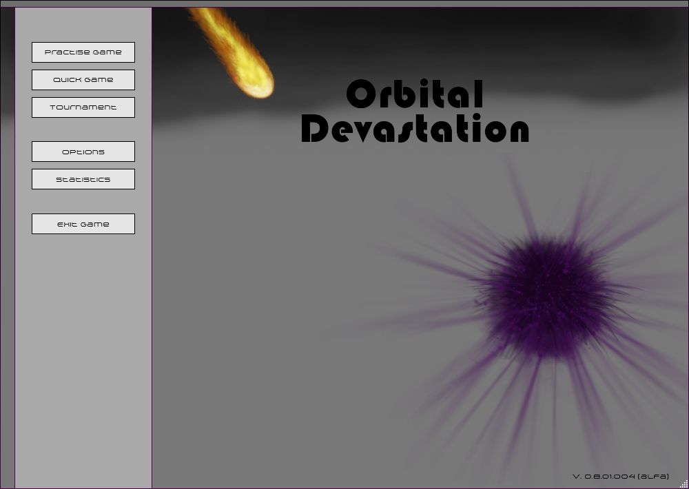
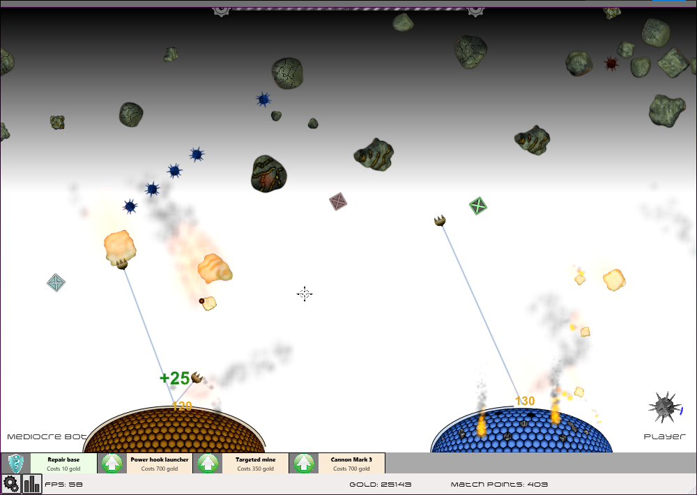
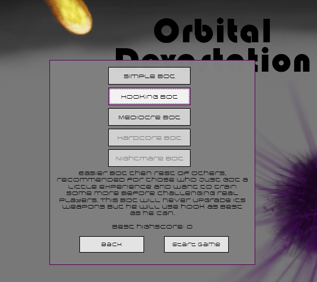
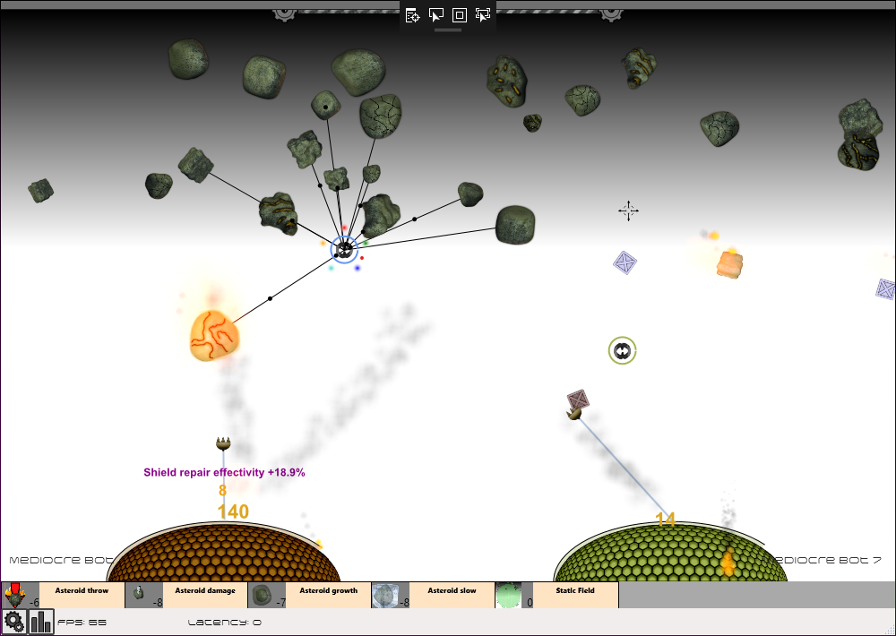

# Orbital Devastation
Orbital Devastation is a fast-paced action 2D single and multiplayer arcade-like game. Drawing inspiration in legendary _Missile Command_ game it features _Beat 'em up_ and _base defence_ elements.

## Gameplay
You are taking a role of a commander of city defences. Your city happens to be under an attack from your rival city. 
Objective is simple - defend your base from falling meteorites and manipulate orbital asteroids to destroy enemy base before you run out of resources!

### Arsenal at your disposal includes:
* Base's shield repair [`key 1`]
* Proximity cannon [`left mouse button`]
  * _Defensive action._ Cannon placed in your base can shoot and destroy falling meteorites.
* Double hook launcher [`right mouse button`]
  * _Defensive action._ Can grab meteorites near your base and neutralize them. It will also harvest caught meteorites for resources.
* Targeted mine [`middle mouse button`]
  * _Offensive action._ Drops mines in planet's orbit. Mines explode upon contact with asteroids and send them flying toward the planet's surface.

### Reources
Resources are limited but can be mined from meteorites. Golden meteorites are much more richer on resources. 

### Upgrades
All three actions can be upgraded by spending resources. There are three stages and also an extra activable ability for every action.

### Power-ups
Additional technology crates can be be found in stratosphere and can be used to improve your various stats and actions.

### Configurable
Most aspect of the game can configured through GUI, such as key bindings, sounds, etc.

### Localized
English and Czech languages included. Other languages can be added easily.

### Statistics
Records of your feats are recorded and shown after every game. Highscores are also available.

## Game Modes
### Singleplayer
Practise games can be player versus five bots of different difficulties. Just one game, no strings attached.

### Multiplayer
#### Quick game
Can be played versus another randomly picked player connected to the same **dedicated server**.

#### Tournament
Players join to lobby through **dedicated server**. Host can choose various game modes, maps, number of rounds, number of bots a bot difficulty. Host can also manage connected players.

##### Mining modules
This mode enables new kind of gameplay. Up to six players can participate. 
Two players are assigned to control bases. 
Remaining players are also assigned to bases (sharing the same objectives as their base) and every one gains control of an **asteroid mining module** flying in the atmosphere.
Mining module features five new abilities which can be used to aid its home base in various ways, offensively and defensively.

## How to play
Just download and extract archive from releases section, extract its content and run `OrbitalDevastation.exe`. Or `MasterServer.exe` for hosting the dedicated server.

## Platform
Windows with .NET framework.

## Technologies
* Custom made game framework
* Custom renderer
* Own assets - images, textures, sprites, shaders, music, sound effects
* Using networing library [Lidgren](https://github.com/lidgren/lidgren-network-gen3)
* WPF, C# and .NET based
